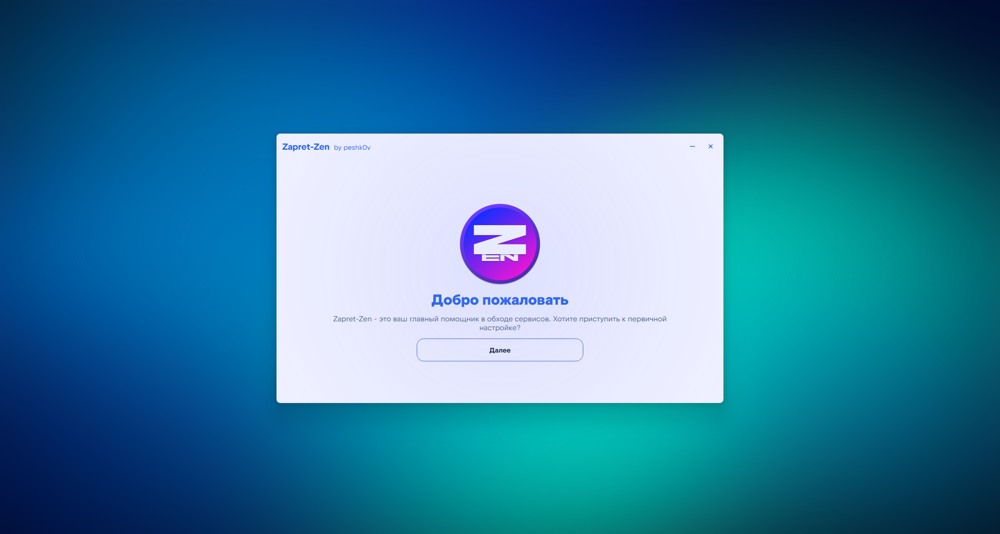
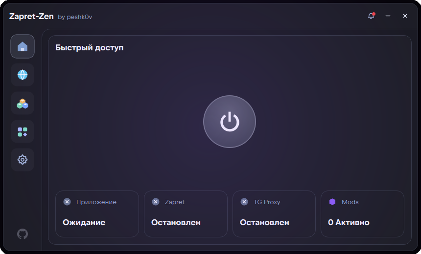
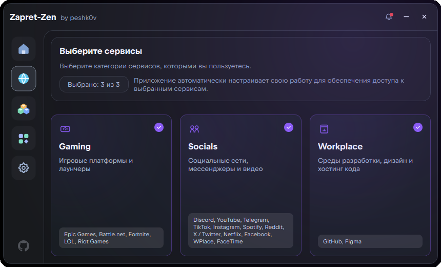
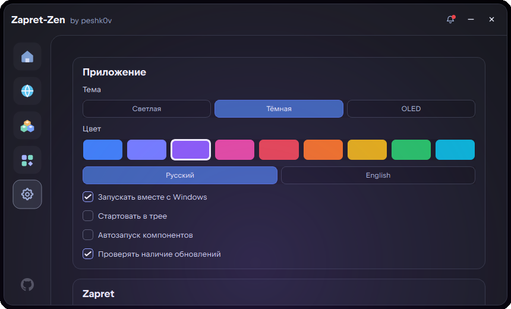

<div align="center">

# Zapret Zen

Утилита для быстрого обхода блокировок на Windows

<picture>
  
</picture>

[](https://python.org)
[](https://doc.qt.io/qtforpython/)
[](LICENSE)
[](https://github.com/peshk0v/Zapret-Zen/releases)

</div>

## Скриншоты

<div align="center">

| Главная | Сервисы | Настройки |
|:---:|:---:|:---:|
|  |  |  |

</div>

## Возможности

| Функция | Описание |
|---|---|
| **Обход блокировок** | Управление компонентами zapret, tg-ws-proxy: запуск, остановка, статус, автозапуск |
| **Пресеты сервисов** | Удобный выбор сервисов по категориям |
| **Система модов** | Устанавливайте, обновляйте и отключайте моды сообщества, расширяющие наборы правил |
| **Движок слияния** | Объединяет базовый runtime + моды + правила сервисов + пользовательские настройки в единую директорию |
| **Динамические темы** | Выбирайте режим (Light / Dark / OLED) и акцентный цвет — интерфейс адаптируется в реальном времени |
| **Диагностика** | Встроенные проверки системы: связность, DNS, здоровье компонентов |
| **Автоконфигурация** | Автоматический выбор стратегии на основе выбранных сервисов |
| **Уведомления** | Внутренняя система уведомлений о событиях и обновлениях |
| **Бекапы** | Автоматические снапшоты перед каждой операцией слияния |
| **Системный трей** | Сворачивание в трей и запуск в трее при автозагрузке |
| **Единственный экземпляр** | Только одна копия программы; повторный запуск показывает существующее окно |
| **Права администратора** | Автоматический перезапуск с правами администратора (требуется для WinDivert) |
| **Автообновления** | Проверка обновлений приложения и модов через GitHub Releases |
| **Локализация** | Полный перевод интерфейса на русский и английский языки |

## Страницы

| Страница | Описание |
|---|---|
| **Главная** | Общий статус, главная кнопка питания, состояние компонентов, быстрая статистика |
| **Сервисы** | Сетка выбора сервисов по категориям — Gaming, Socials, Workplace |
| **Компоненты** | Управление zapret, TG WS Proxy|
| **Модификации** | Просмотр, установка, включение и отключение модов сообщества |
| **Настройки** | Настройки приложения, Zaptet, Tg Ws Proxy, логи, диагностика |

## Установка

### Портативная (рекомендуется)

1. Скачайте `ZapretZen_<version>_portable.zip` из [Releases](https://github.com/peshk0v/Zapret-Zen/releases)
2. Распакуйте в любую папку
3. Запустите `zapret_zen.exe` (права администратора запрашиваются автоматически)

### Установщик

1. Скачайте `install_zapretzen_<version>_universal.exe` из [Releases](https://github.com/peshk0v/Zapret-Zen/releases)
2. Запустите — установщик развернёт приложение и зарегистрирует запись в списке установленных программ

## Разработка

### Требования

- Python 3.11
- Windows 10+

### Настройка окружения

```powershell
python -m venv .venv
.\.venv\Scripts\Activate.ps1
pip install -e .[dev]
```

### Запуск из исходников

```powershell
.\.venv\Scripts\python.exe -m zapret_zen.main
```

### Сборка портативной версии

```powershell
.\.venv\Scripts\python.exe scripts\sync_app_icon.py
.\.venv\Scripts\pyinstaller.exe packaging/zapret_zen.spec --distpath dist_pyinstaller --workpath build_pyinst --noconfirm
```

### Сборка установщика

```powershell
# После сборки портативной версии создайте архив с payload:
$tempDir = Join-Path $env:TEMP "zapretzen_payload"
$payloadRoot = Join-Path $tempDir "zapret_zen"
Copy-Item -LiteralPath dist_pyinstaller\zapret_zen -Destination $payloadRoot -Recurse -Force
Compress-Archive -Path (Join-Path $tempDir "*") -DestinationPath installer_payload\win_x64.zip -CompressionLevel Optimal -Force
Remove-Item $tempDir -Recurse -Force

# Соберите установщик:
.\.venv\Scripts\pyinstaller.exe packaging/install_zapretzen.spec --distpath dist_installer --workpath build_installer --noconfirm
```

### Создание скриншотов

```powershell
.\.venv\Scripts\python.exe scripts\take_screenshots.py
```

## Структура проекта

```
Zapret-Zen/
├── assets/           # Скриншоты и баннеры для README
├── configs/          # Пользовательские конфиги (переопределение правил)
├── data/             # Состояние приложения (настройки, профили, уведомления)
├── installer/        # Исходный код установщика
├── mods/             # Установленные моды сообщества
├── packaging/        # .spec файлы для PyInstaller
├── runtime/          # Встроенные инструменты (zapret, tg-ws-proxy, v2rayN)
├── scripts/          # Скрипты сборки, скриншотов и утилиты
├── src/zapret_zen/   # Исходный код приложения
│   ├── domain/       # Модели данных (настройки, компоненты, сервисы)
│   ├── services/     # Бизнес-логика (бэкенд, настройки, слияние, обновления)
│   └── ui/           # Интерфейс PySide6 (main_window.py, theme.py)
├── themes/           # JSON-файлы пользовательских тем
└── ui_assets/        # Иконки, шрифты, логотипы сервисов
```

## Технологии

- **Python 3.11+** — основной язык
- **PySide6** — привязки Qt6 для интерфейса
- **PyInstaller** — упаковка в standalone исполняемый файл под Windows
- **WinDivert** — перехват и фильтрация сетевых пакетов (используется zapret)

## Лицензия

[MIT](LICENSE)
