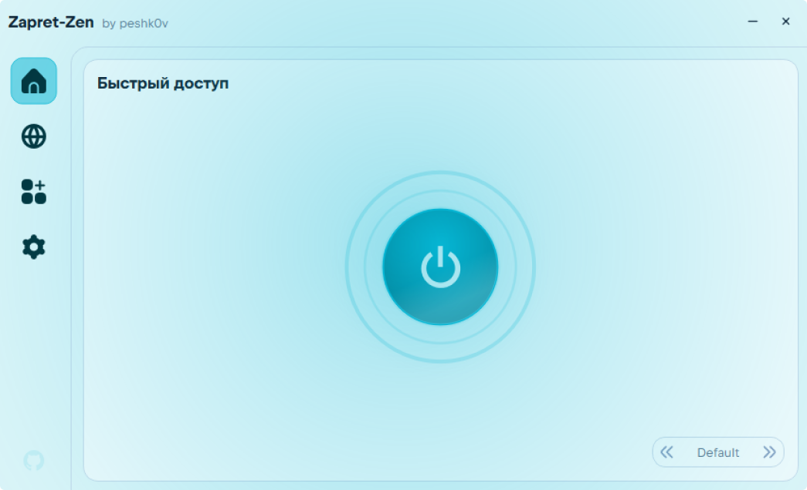
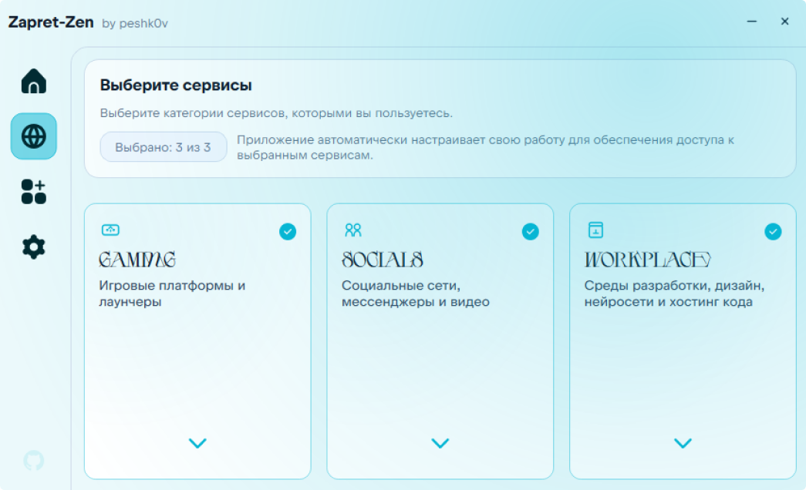
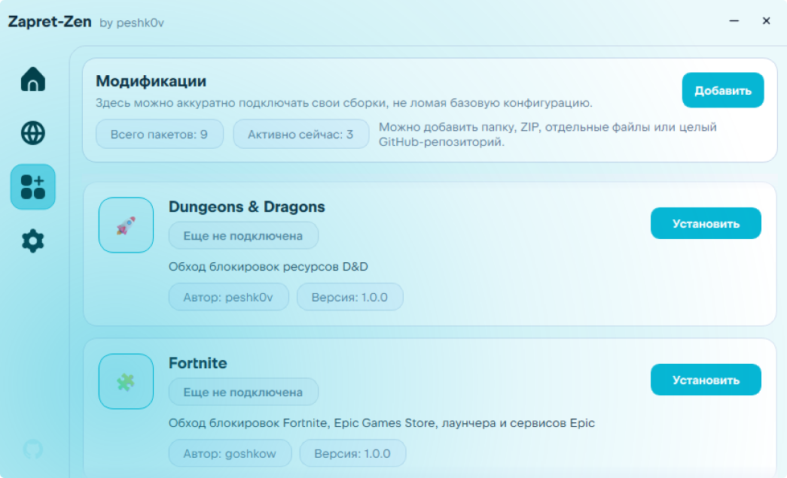

<picture>
  
</picture>

# Zapret Zen

**Утилита для удобного и быстрого обхода блокировок на Windows**

 
 

## 🖼️ Скриншоты

| Главная | Сервисы | Модификации |
| :---: | :---: | :---: |
| <picture><source media="(prefers-color-scheme: dark)" srcset="assets/screenshot_dashboard_dark.png"><source media="(prefers-color-scheme: light)" srcset="assets/screenshot_dashboard_light.png"></picture> | <picture><source media="(prefers-color-scheme: dark)" srcset="assets/screenshot_services_dark.png"><source media="(prefers-color-scheme: light)" srcset="assets/screenshot_services_light.png"></picture> | <picture><source media="(prefers-color-scheme: dark)" srcset="assets/screenshot_mods_dark.png"><source media="(prefers-color-scheme: light)" srcset="assets/screenshot_mods_light.png"></picture> |

---

## ⚙️ Возможности

| Функция | Описание |
| :--- | :--- |
| 🛡️ **Обход блокировок** | Управление компонентами `zapret` и `tg-ws-proxy`: запуск, остановка, просмотр статуса, фоновый автозапуск |
| 👤 **Профили настроек** | Быстрое переключение между готовыми конфигурациями и пресетами под разные задачи и сети |
| 🎛️ **Пресеты сервисов** | Быстрый и удобный выбор сервисов, разбитых по категориям |
| 🧩 **Система модов** | Установка, обновление и отключение пользовательских модов сообщества для расширения правил |
| 🎨 **Динамические темы** | Кастомизация интерфейса: Light, Dark, OLED темы и настраиваемые акцентные цвета |
| 🩺 **Диагностика** | Встроенный модуль проверки системы: тест связности, проверка DNS и целостности компонентов |
| ⚙️ **Автоконфигурация** | Автоматический подбор оптимальной стратегии на основе выбранных сервисов |
| 🔔 **Уведомления** | Нативная система информирования о событиях, ошибках и выходе обновлений |
| 📥 **Системный трей** | Работа в фоновом режиме, сворачивание и тихий запуск при старте ОС |
| 🔄 **Автообновления** | Автоматическая проверка свежих релизов приложения и модов прямо с GitHub |
| 🌐 **Локализация** | Полная поддержка русского и английского языков |

---

## 🧩 Доверенные моды сообщества

Готовые модификации для Zapret-Zen от сообщества: обход блокировок Minecraft, Roblox, SoundCloud, Canva и других сервисов.

> Подробная инструкция по установке, созданию и публикации собственных модов — в **[документации по модам](https://github.com/peshk0v/Zapret-Zen/wiki/%D0%9C%D0%BE%D0%B4%D0%B8%D1%84%D0%B8%D0%BA%D0%B0%D1%86%D0%B8%D0%B8#13-доверенные-каталоги-модов-от-сообщества)**.

---

## 💻 Установка

### 📦 Портативная версия (Рекомендуется)

1. Скачайте архив `zapret_zen_<version>_portable_win_<architecture>.zip` со страницы [Releases](https://github.com/peshk0v/Zapret-Zen/releases) под вашу архитектуру CPU.
2. Распакуйте содержимое в удобную папку.
3. Запустите `zapret_zen.exe`.

### 💿 Инсталлятор

1. Скачайте файл `install_zapretzen_<version>_universal.exe` со страницы [Releases](https://github.com/peshk0v/Zapret-Zen/releases).
2. Запустите мастер установки — он развернёт программу и добавит запись в стандартный список приложений Windows.

---

## 🛠️ Вики для разработчиков

У проекта есть *полноценный* wiki, в котором подробно расписаны детали для разработки проекта.

---

## 🧲 Используемые компоненты

| Инструмент | Автор / Проект |
| --- | --- |
| **zapret-discord-youtube** | [Flowseal](https://github.com/Flowseal/zapret-discord-youtube) |
| **tg-ws-proxy** | [Flowseal](https://github.com/Flowseal/tg-ws-proxy) |
| **zapret ecosystem** | [bol-van](https://github.com/bol-van/zapret-win-bundle) |

> [!CAUTION]
> ### Авторство и правовая информация
> 
> 
> **Zapret Zen** является модификацией проекта **[Zapret Hub](https://github.com/goshkow/Zapret-Hub)** от [goshkow](https://github.com/goshkow), ныне поддерживающийся [klondike0x](https://github.com/klondike0x).
> Приложение не присваивает себе авторство встроенных утилит, оригинального интерфейса и менеджера. Пользователь вправе модифицировать файлы самостоятельно, однако авторские права оригинальных разработчиков сохраняются.
> В графическом интерфейсе используются иконки Uicons, права на которые принадлежат [Flaticon](https://www.flaticon.com/uicons).

---

## 📞 Обратная связь

| Назначение | Ссылка |
| --- | --- |
| 🐛 **Баг-трекер** | [Сообщить об ошибке](https://github.com/peshk0v/Zapret-Zen/issues/new) |
| 💬 **Обсуждения** | [Задать вопрос или предложить идею](https://github.com/peshk0v/Zapret-Zen/discussions) |
| 📢 **Новости** | [Telegram-канал проекта](https://t.me/zapzen) |

<strong>FAQ: Часто задаваемые вопросы</strong>

 

**Браузер / антивирус детектит портативную версию как вирус**

Портативная версия упакована через PyInstaller, который запаковывает Python-интерпретатор и все зависимости в один `.exe`. Отдельные антивирусы реагируют на такую архитектуру ложными срабатываниями — это стандартная проблема для любых нестандартных сборок на Python.

Для проверки загрузите файл на [VirusTotal](https://www.virustotal.com/). Если среди результатов только эвристика (heuristic) или флаги упаковщика (packed) — это обычная ложная тревога.
> Подробнее: [#16914](https://github.com/Flowseal/zapret-discord-youtube/discussions/16914#discussioncomment-18097448)

---

**Установщик (installer) детектится как вирус**

Windows Defender реагирует на установщик из-за упаковки Python-интерпретатора через Nuitka/PyInstaller в единый `.exe`. Антивирусы часто параноят на подобные архитектуры — это стандартное поведение для большинства Python-проектов.

Для спокойствия можно загрузить файл на [VirusTotal](https://www.virustotal.com/). Если среди результатов только эвристика (heuristic) или флаги упаковщика (packed) — это обычная ложная тревога. Ранее с этим сталкивался и zapret-hub (до v3.0.0).

> Подробнее: [#2](https://github.com/peshk0v/Zapret-Zen/discussions/2#discussioncomment-18094279)

---

## ©️ Лицензия

Распространяется под лицензией [MIT](https://www.google.com/search?q=LICENSE).
