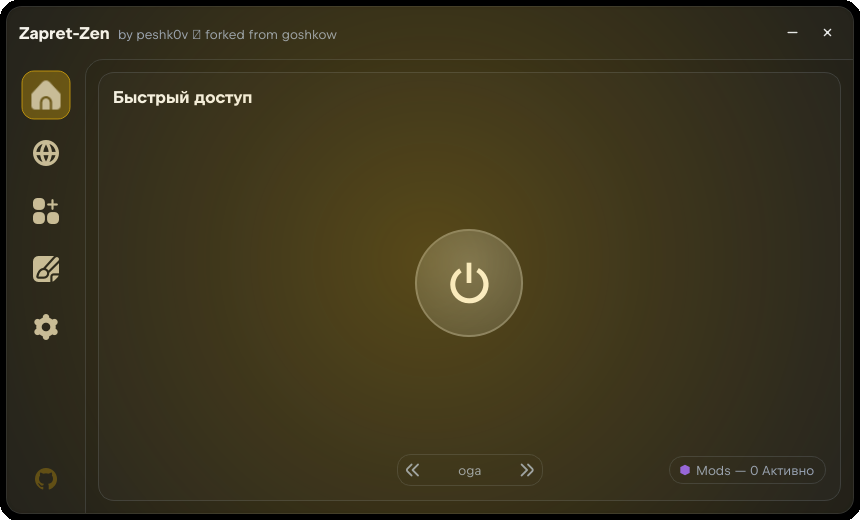
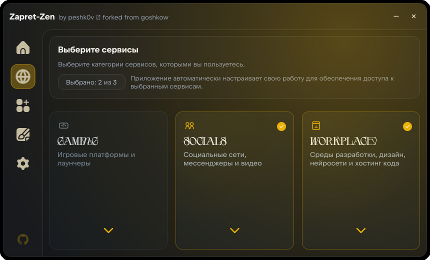

## Zapret Zen 2.2

### 🚀 Главное
- Добавлена **система профилей** — сохраняйте и переключайте разные наборы настроек одним кликом.
- Переработана навигация по сервисам: стрелки-шевроны вместо текстовых кнопок.
- Все компоненты обновлены до последних версий.
- Удалён каталог модов (репозиторий больше не поддерживается).

### 🎨 Скриншоты

| Главная | Сервисы |
| :---: | :---: |
|  |  |
|  |  |

### ✨ Система профилей
- На главной странице появилась **карусель профилей** с анимированными стрелками — переключайте профили прямо с дашборда.
- В настройках добавлена секция **«Профили»**: создание, переименование и удаление профилей.
- При переключении профиля компоненты **автоматически перезапускаются** с новыми настройками — кнопка питания показывает анимацию загрузки.
- Профиль «Основной» создаётся автоматически и не удаляется.

### 🎨 UI изменения
- Кнопки раскрытия категорий сервисов заменены на **анимированные шевроны** — стрелки плавно поворачиваются при раскрытии/сворачивании.
- Заголовки категорий сервисов теперь используют шрифт **Headers** размером 22px.
- Иконки сервисов в категориях всегда отображаются в акцентном цвете.
- Убран текст «Показать/Скрыть сервисы» с кнопок раскрытия.

### ⚙️ Функциональные изменения
- **zapret-discord-youtube** — обновлены скрипты запуска и добавлены новые бинарные файлы (QUIC, STUN, TLS).
- **tg-ws-proxy** — обновлён до последней версии.
- Добавлена ссылка на flaticon.com в раздел «О прилизении».

### 🗑️ Удалено
- **Каталог модов** — удалена вкладка «Каталог» на странице модификаций. Импорт модов из GitHub (любой репозиторий) продолжает работать через кнопку «Добавить».
